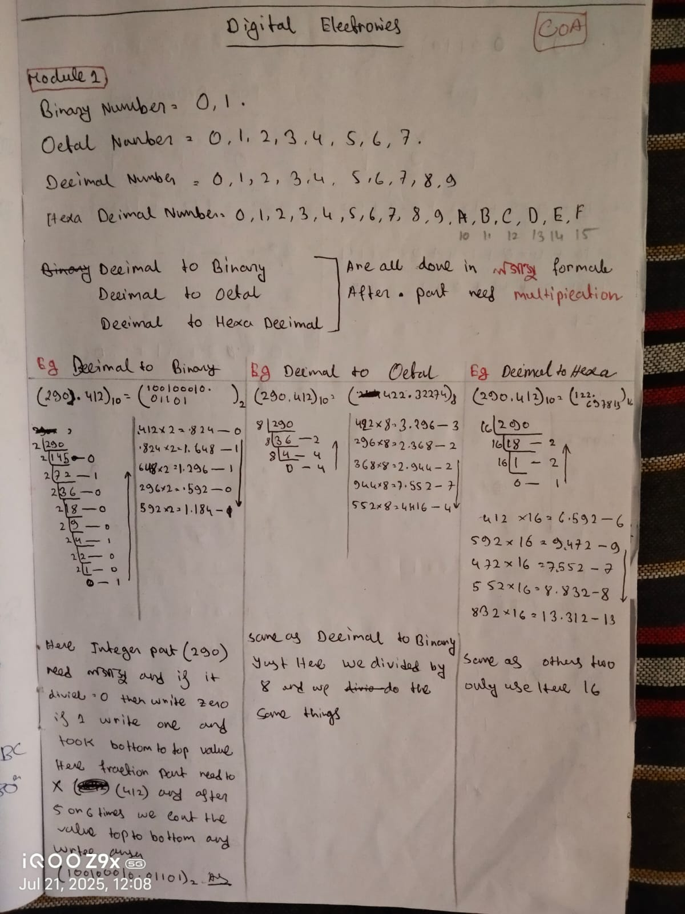
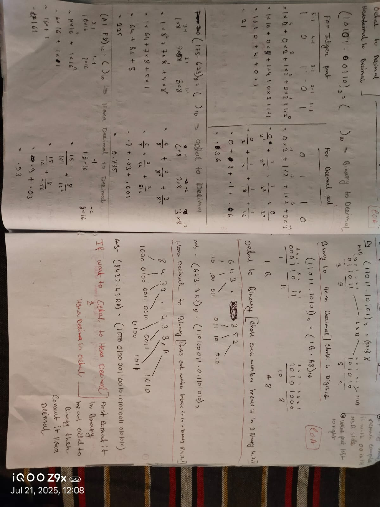

## 2025, July 21 - Monday 06:26:AM Week : 30

# L12-of-DSA

## 📘 Title: **Number Building & Base‑Conversion in C++**

---





### 1. Building Multi‑Digit Numbers via Concatenation

You can assemble digits into a larger integer by repeatedly shifting the current value left (×10) and adding the next digit:

```cpp
int ans = 0;
int a = 6, b = 9, c = 6;

// 696 = ((0 * 10 + 6) * 10 + 9) * 10 + 6
ans = ans * 10 + a;
ans = ans * 10 + b;
ans = ans * 10 + c;
cout << ans << endl;      // 696

// The same idea—placing d,e,f at the correct decimal places:
ans = 0;
int d = 5, e = 4, f = 9;

// 945 = (5 * 100) + (4 * 10) + (9 * 1)
ans = d * 100 + e * 10 + f * 1;
cout << ans << endl;      // 945
```

> **Why It Works:**  
> Each time you multiply by 10 you “make room” for one more digit in the units place.

---

### 2. Decimal → Binary Conversion

To get the binary representation of an integer:

1. **Divide** by 2 repeatedly,
2. **Record** each remainder (0 or 1),
3. **Build** the binary number by placing each remainder at the next higher decimal power of 10.

```cpp
int nums = 32;
int ans = 0, rem, place = 1;

while (nums > 0) {
    rem  = nums % 2;
    nums = nums / 2;
    ans  = ans + rem * place;
    place *= 10;           // shift “digit” one place to the left
}
cout << ans << endl;       // 100000
```

> **Illustration for 32:**  
> 32 ÷2 → rem 0, 16 ÷2 → 0, 8 ÷2 → 0, 4 ÷2 → 0, 2 ÷2 → 0, 1 ÷2 → 1  
> Remainders bottom‑up: 100000₂

---

### 3. Binary → Decimal Conversion

To convert a binary integer (e.g. 10101011₂) back to decimal:

1. **Extract** each least significant bit (mod 10),
2. **Multiply** by the current power of 2,
3. **Accumulate** into a running total.

```cpp
int num2   = 10101011;
int total  = 0, rem2, power = 1;

while (num2 > 0) {
    rem2   = num2 % 10;    // get last “binary digit”
    num2  /= 10;
    total += rem2 * power; // add rem2 × (2⁰,2¹,2²,…)
    power *= 2;
}
cout << total << endl;     // 171
```

> **Step‑by‑Step for 10101011₂:**  
> 1×2⁰ + 1×2¹ + 0×2² + 1×2³ + 0×2⁴ + 1×2⁵ + 0×2⁶ + 1×2⁷  
> = 1 + 2 + 0 + 8 + 0 + 32 + 0 + 128 = **171**

---

### 4. General Base Conversion Notes (from your images)

#### 4.1 Number Systems

- **Binary (base 2):** digits 0,1
- **Octal (base 8):** digits 0–7
- **Decimal (base 10):** digits 0–9
- **Hexadecimal (base 16):** digits 0–9,A–F (A=10…F=15)

#### 4.2 Integer Part Conversion (Decimal → Base N)

- **Repeated division** by N, record remainders, read **bottom→top**.

#### 4.3 Fractional Part Conversion (Decimal → Base N)

- **Repeated multiplication** of the fractional part by N, record the integer part each time.

> **Example:** Convert 0.412₁₀ → octal (base 8)  
> 0.412×8 = 3.296 → record 3  
> 0.296×8 = 2.368 → record 2  
> 0.368×8 = 2.944 → record 2  
> … so 0.412₁₀ ≈ 0.322₂₈

#### 4.4 Converting Other Ways

- **Binary → Octal:** group bits in threes (from the radix point outward).
- **Binary → Hex:** group bits in fours.
- **Octal/Hex → Binary:** reverse the grouping.

---

# Summary

1. **Digit Concatenation**: multiply your accumulator by 10 (or base N) and add the next digit.
2. **Decimal → Binary**: divide by 2 → collect remainders → assemble bottom‑up.
3. **Binary → Decimal**: extract bits (mod 10) → multiply by powers of 2 → sum.
4. **General Base Conversion**:

   - **Integer**: repeated division method.
   - **Fractional**: repeated multiplication method.
   - **Cross‑base**: use bit‑grouping for binary↔octal/hex.
